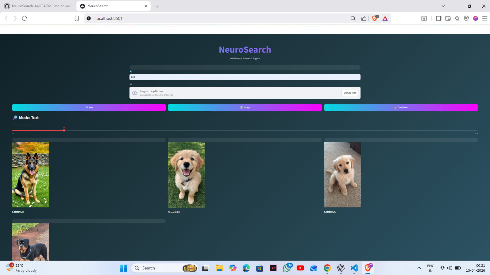
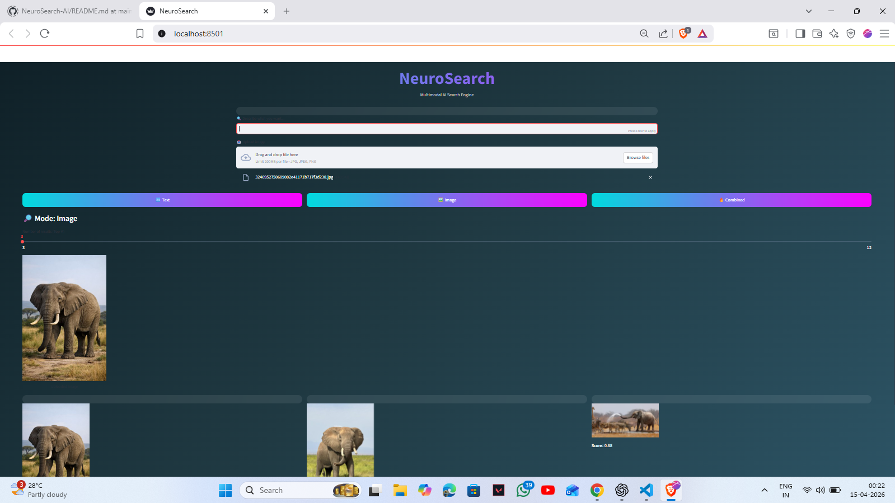
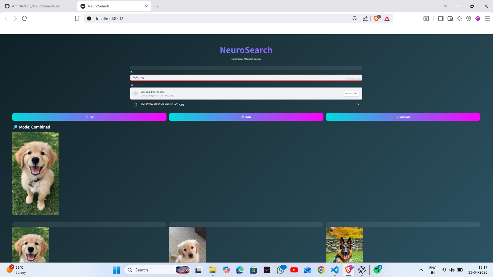

# 🔍 NeuroSearch — Multimodal AI Search Engine

NeuroSearch is a modern AI-powered multimodal search system that enables users to retrieve images using **text, image, or a combination of both**.

Unlike traditional keyword-based systems, NeuroSearch understands the **semantic meaning** of queries using the CLIP (Contrastive Language–Image Pretraining) model and performs cross-modal retrieval in a shared embedding space.

---

## 🚀 Key Features

- 🔤 **Text → Image Search**  
  Retrieve relevant images using natural language queries  

- 🖼️ **Image → Image Search**  
  Upload an image to find visually similar images  

- 🔥 **Combined Search (Text + Image)**  
  Refine search results using both modalities  

- 📊 **Similarity-Based Ranking**  
  Uses cosine similarity for accurate ranking  

- 🎨 **Modern UI**  
  Stunning glassmorphism-based interface built with Streamlit  

---

## 🧠 How It Works

NeuroSearch follows a simple yet powerful pipeline:
Input (Text / Image)
↓
CLIP Embedding (Shared Vector Space)
↓
Cosine Similarity Calculation
↓
Ranking
↓
Top Matching Results


Both text and images are converted into embeddings using CLIP, enabling **cross-modal understanding**.

---

## 🛠️ Tech Stack

- Python  
- PyTorch  
- OpenAI CLIP  
- Streamlit  
- NumPy  

---

## 📸 Screenshots

### 🔤 Text Search


### 🖼️ Image Search


### 🔥 Combined Search


---

## 📂 Project Structure
NeuroSearch/
│── app.py # Main application (UI + logic)
│── model.py # CLIP embedding functions
│── utils.py # Similarity calculations
│── requirements.txt # Dependencies
│── screenshots/ # UI images
│── images/ # Dataset


---

## ▶️ Run Locally

```bash
git clone https://github.com/AmitAI2C09/NeuroSearch-AI.git
cd NeuroSearch-AI
pip install -r requirements.txt
streamlit run app.py

📌 Future Improvements
Improve retrieval accuracy
Integrate FAISS for faster similarity search
Deploy as a web application
Expand dataset for better generalization

👨‍💻 Author

Amit Prakash Singh
B.Tech Computer Science (AI)

⭐ Acknowledgements
OpenAI CLIP Model
Streamlit Framework
